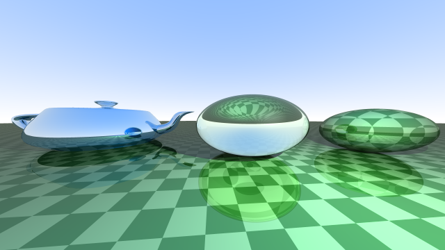

# mhn-rt

`mhn-rt` is a a simple toy raytracer. It implements a variant of Whitted raytracing algorithm and Phong material. Currently supported functions:

## Supported features:
- Rendering scenes made of spheres and triangle meshes
	- Bounding Volume Hierarchy is used for fast ray-triangle intersection search.
- Loading triangle meshes from (subset of) .obj and .mtl files
- Simple 2D and 3D checker textures
- Bitmap based PNG textures and normal maps (as long as uv mapping is defined)
- Saving resulting render as .png

## Examples (using 3rd party models)

## Libraries used:
- OpenTK (used for Vectors and Matrices)

## Usage:
Simple text based interface is implemented. After startup, the user is asked to select a builtin scene and specify parameters of resulting image (width, height, samples per pixel, filename...)

## Technical documentation:
