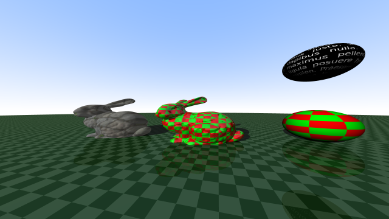

# mhn-rt

`mhn-rt` is a a simple toy raytracer. It implements a variant of Whitted raytracing algorithm and Phong reflection model.

## Supported features:
- Rendering scenes made of spheres and triangle meshes
	- Bounding Volume Hierarchy is used for fast ray-triangle intersection search.
		- Construction uses top-down approach as described in [Physically Based Rendering, 3rd edition](http://www.pbr-book.org/3ed-2018/Primitives_and_Intersection_Acceleration/Bounding_Volume_Hierarchies.html)
- Loading triangle meshes from (subset of) .obj and .mtl files
- Simple 2D and 3D checker textures
- Bitmap based PNG textures (as long as uv mapping is defined)
	- Linear interpolation is used
- Saving resulting render as .png

## Examples (using 3rd party models)

## External libraries:
- OpenTK (used for Vectors and Matrices)

## Usage:
Run the application, either from Visual Studio or by directly starting the executable. Note that the current working directory has to be the one with the executable and that it has to contain the testModels directory (which is copied on build).

Simple text based interface is implemented. After startup, the user is asked to select a builtin scene and specify parameters of resulting image (width, height, samples per pixel and filename)

## Technical documentation:
[Here](TechnicalDocumentation.md)

## Caveats:
- All relative paths are relative to the current working directory (even those used in .obj files)

## Bugs:
- Normal maps are broken